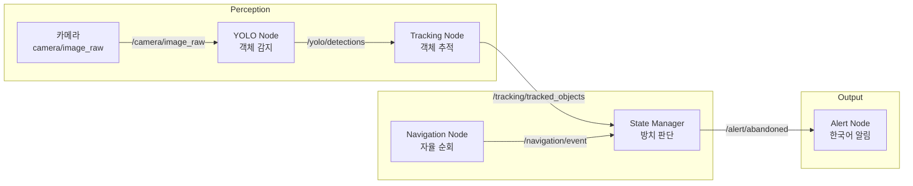

# 카페 순찰 로봇 시스템 🤖☕

## 팀 정보

| 항목 | 내용 |
|------|------|
| 팀명 | 투들스 |
| 팀원 | 김남우 |
<br />

## 프로젝트 개요

TurtleBot3가 카페 내 테이블을 waypoint 기반으로 순회하며 YOLOv8을 이용해 방치된 물건을 감지하고, 일정 횟수 이상 감지되면 알림을 발행합니다.
<br />

## 시스템 아키텍처


<br />

## 기술 스택

- **ROS2 Humble**
- **Gazebo Classic 11** - 시뮬레이션 환경
- **TurtleBot3 Burger** - 로봇 플랫폼
- **Nav2** - Waypoint 기반 주행
- **YOLOv8n** - 객체 감지
- **Python 3.10**
<br />

## 노드 설명

| 노드 | 역할 |
|------|------|
| `navigation_node` | Nav2 기반 웨이포인트 순회 |
| `yolo_node` | YOLOv8을 이용한 실시간 객체 감지 |
| `tracking_node` | IoU 기반 객체 추적 (SimpleTracker) |
| `table_mapping_node` | 웨이포인트 기반 테이블 매핑 |
| `state_manager_node` | 방치 판단 및 알림 트리거 |
| `alert_node` | 알림 출력 |

## 감지 가능 물체 및 방치 임계값

| 물체 | 임계값 (사이클) |
|------|----------------|
| 컵, 병 | 6회 |
| 배낭, 가방, 여행가방 | 3회 |
| 노트북 | 3회 |
| 휴대폰, 책 | 4회 |
<br />

## 알림 정책

- 임계값 초과 시 해당 cycle의 counter 도착 후 즉시 알림 발행
- 알림 후 **3 사이클** 동안 재알림 억제 (alert cooldown)
- 직원이 물건을 치운 경우(빈 테이블로 감지) 자동으로 카운트 초기화
<br />

## 환경 구성

### 필수 패키지

```bash
# ROS2 Humble + TurtleBot3
sudo apt install ros-humble-turtlebot3* ros-humble-nav2*

# YOLOv8
pip install ultralytics
pip install 'numpy<2'
```
<br />

### 빌드

```bash
cd ~/cafe_robot_ws
colcon build --symlink-install
source install/setup.bash
```
<br />

## 실행 방법

### 1. Gazebo 실행

```bash
source /opt/ros/humble/setup.bash
source ~/cafe_robot_ws/install/setup.bash
source /usr/share/gazebo/setup.bash
export DISPLAY=:0
export LIBGL_ALWAYS_SOFTWARE=1
export GALLIUM_DRIVER=llvmpipe
ros2 launch cafe_robot cafe_world_launch.py
```
<br />

### 2. Nav2 실행

```bash
ros2 launch cafe_robot nav2_launch.py
```
<br />

### 3. 초기 위치 설정

```bash
ros2 topic pub -t 3 --rate 5 /initialpose geometry_msgs/msg/PoseWithCovarianceStamped '{
  header: {frame_id: "map"},
  pose: {
    pose: {
      position: {x: 0.0, y: 0.0, z: 0.0},
      orientation: {w: 1.0}
    },
    covariance: [0.25,0,0,0,0,0, 0,0.25,0,0,0,0, 0,0,0,0,0,0,
                 0,0,0,0,0,0, 0,0,0,0,0,0, 0,0,0,0,0,0.06853]
  }
}'
```
<br />

### 4. 전체 노드 실행

```bash
# YOLO 감지
ros2 run cafe_robot yolo_node.py

# 객체 추적
ros2 run cafe_robot tracking_node.py

# 상태 관리
python3 ~/cafe_robot_ws/src/cafe_robot/cafe_robot/state_manager_node.py

# 알림
ros2 run cafe_robot alert_node.py

# 자율 순회
python3 ~/cafe_robot_ws/src/cafe_robot/cafe_robot/navigation_node.py
```
<br />

## 카페 환경

- 테이블 4개 (각 1m×1m×0.75m)
- 테이블 3 (-2, -2): 머그컵
- 테이블 4 (2, -2): 배낭

## WayPoint

| 위치 | 좌표 |
|------|------|
| 홈(출발 지점) | (0.0, 0.0) |
| 테이블 1 | (-1.5, 1.5) |
| 테이블 2 | (1.5, 1.5) |
| 테이블 3 | (-1.5, -1.5) |
| 테이블 4 | (1.5, -1.5) |
<br />

## 개발 환경

- Ubuntu 24.04 (WSL2)
- ROS2 Humble Hawksbill
- Python 3.10
<br />

## 참고 자료

- [ROS2 Humble 공식 문서](https://docs.ros.org/en/humble/)
- [Nav2 공식 문서](https://navigation.ros.org/)
- [YOLOv8 (Ultralytics)](https://github.com/ultralytics/ultralytics)
- [TurtleBot3 공식 문서](https://emanual.robotis.com/docs/en/platform/turtlebot3/overview/)
- [Gazebo Classic 공식 문서](http://gazebosim.org/tutorials)
<br />

## Youtube Link
[youtube_link](https://youtu.be/a_p1IvYfmFo)
<br />
